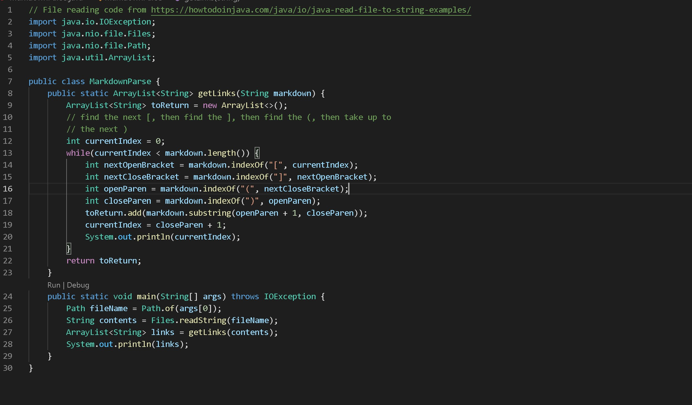
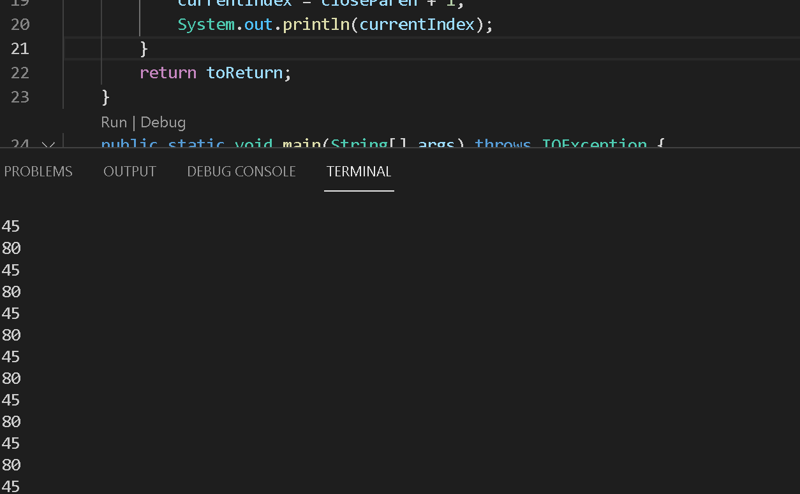
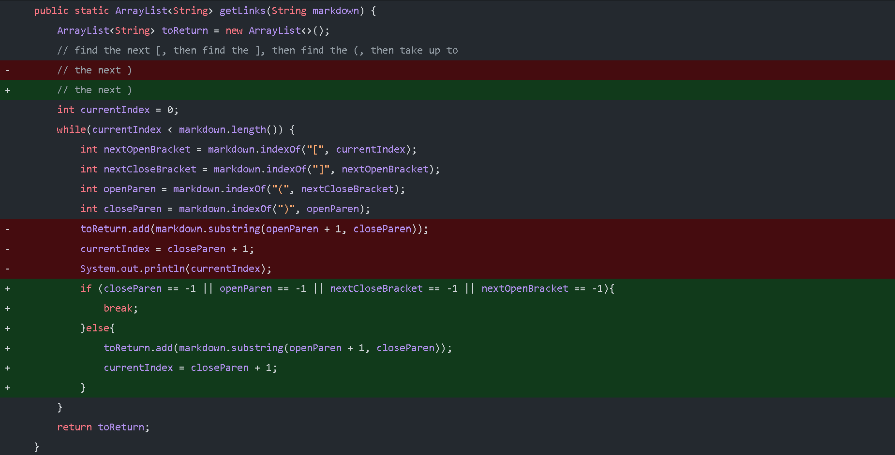
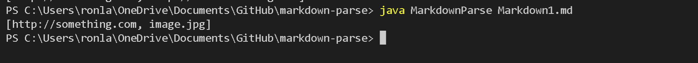
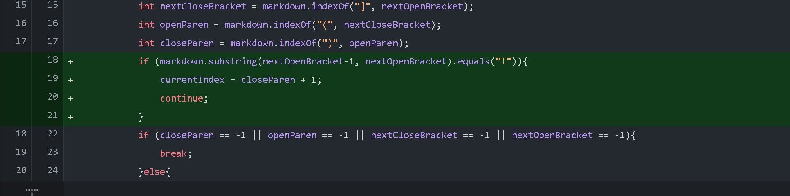
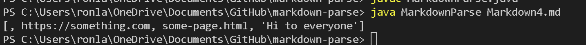
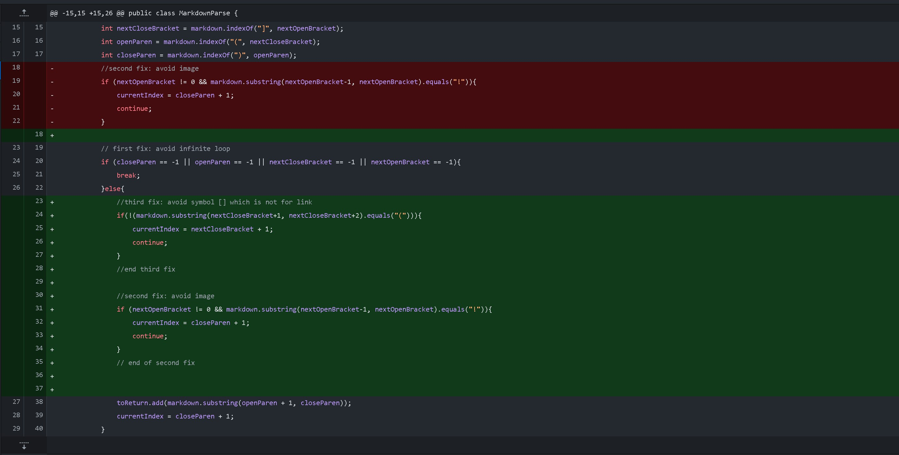

# CSE 15L
## Week 4 Lab Report 2
\
In this Lab Report, we are trying to debug the follwing code and pick three code changes that my group worked in labs 3 and 4.

### The first bug
---

## [Test File](Markdown3.md)
\
\
If our test file has some additional word after the last parentheses, the algorithm will enter a infinite loop. After the algorthm search the last link, it will find the next bracket and parenthesis using the method indexOf, which will return -1. Therefore, when we update the currentIndex at line 19, the currentIndex will go back to 0 and search link again at the beginning.  
\
\
 
### Solution
---
Since we do not have any more links in the file, we can exit the loop early to avoid the bug. We can use a if-else statement to do it.
\
\

\
\
 

## The second bug
---

## [Test File](Markdown1.md)

\
Markdown file is using a similar structure for link and image. The algorithm may read a image as a link and put it into the Arraylist. 
>  Image: ![image_name] (link)

>  link: [name] (link)

### Solution
---
We want to make sure that the program will not read an image as link, so we have to make sure that there is no exclamation mark before the open bracket. If there is a exclamation mark, then we should skip the image and read after the close parenthesis.

\
\
 

## The Thrid bug
---

## [Test File](Markdown4.md)
\
People may use bracket or parenthesis in their sentence, and the algorithm may read them as a link. Hence, we will have thing other than link inside the Arraylist.

### Solution
---
If it is a link, then the open parenthesis should be after a closing bracket. Otherwise, we can skip it and read the following file.

