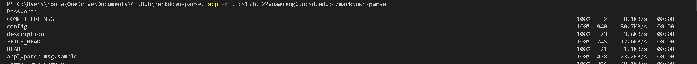

# [CSE 15L](https://ronlai8o.github.io/cse15l-lab-reports/)
### Week 6 - Remote Access and File sysyem
\
In this lab reports, I choose Question 3: Copy whole directories with the command __scp -r__

Command __scp -r__ is used to send a directory of file to other servers. If we want to send the current directory, we can use __scp -r .__ to indicate current directory. 
\
\
The general strucutre of the __scp -r__ command is
        
        scp -r (source) (target)
The source means which files you want to move, and the target means move to which directory.

\
After we use the __scp -r__ command, we can find it in our remote servers.
\
\

\
We can see that there is the copy of my markdown-parse file, and we can also do the test in the remote server now.
\
\
If you do not like typing command in multiple line, you can also type them in one line. 
\
\

The image above shows how to do multiple command in one line.
\
We can use semicolon(;) sepeate the commands, so the command line can read scp and ssh in the same line.
In addition, we can use Quotation mark("") after ssh command to indicate using the commands inside the quotation mark on other server.

