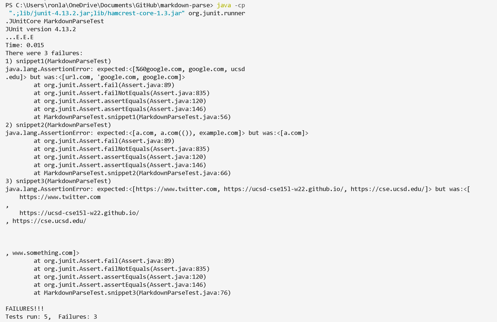
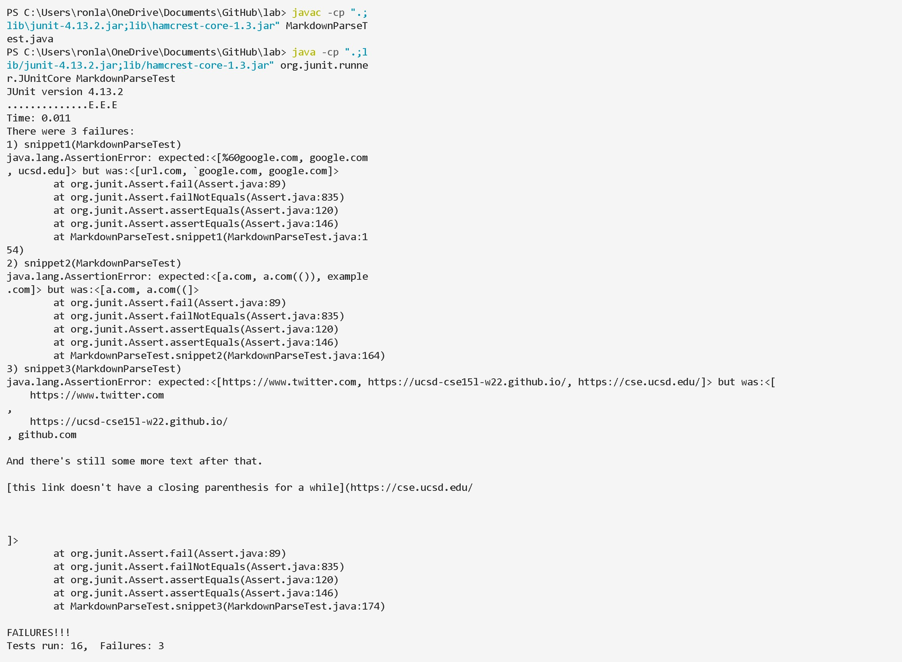

### Lab Report 4 - CSE 15L Week 8
\
\
During this lab, I used the markdown-parse code from these two Repository.  
 
&nbsp;&nbsp;&nbsp;&nbsp;&nbsp; my implementation: [https://github.com/RonLai8o/markdown-parse.git](https://github.com/RonLai8o/markdown-parse.git)
\
&nbsp;&nbsp;&nbsp;&nbsp;&nbsp;&nbsp;the implementation I reviewed: [https://github.com/tylercyang/markdown-parse](https://github.com/tylercyang/markdown-parse)
    
My implementation test's result
\
\

\
\
My reviewed implementation test's result
\
\

### Lab Questions
1. Do you think there is a small (<10 lines) code change that will make your program work for snippet 1 and all related cases that use inline code with backticks? If yes, describe the code change. If not, describe why it would be a more involved change.
    \
    \
    I don't think a small code change that will make my program work for snippet 1 and all related cases that use inline code with backticks. We can track whether there is a backticks before open parentheses to know whether we searched code or not.If our search is code, then we can search the corresponding number of backticks to skip the code part and go to the next loop. This part need one while loop and 3 or four if-statement, so it will take mroe than 10 lines when the if-statement and while-loop take at least two line for each. 
    \
    \
    In addition, if the backticks is a part of link, bewteen the open parentheses and closing parentheses, then we just need to conver it to %60. This part can take 3 to four lines.
    \
     
1. Do you think there is a small (<10 lines) code change that will make your program work for snippet 2 and all related cases that nest parentheses, brackets, and escaped brackets? If yes, describe the code change. If not, describe why it would be a more involved change.
    \
    \
    I am not able to make a small code change to make my program work for snippet 2 and all related cases because this fix required multiple while loop to search bracket, parentheses, and escaped brakets. When while-loop and if-statement required more than two line, the fix has to have more than 10 lines. 
    \
     
1. Do you think there is a small (<10 lines) code change that will make your program work for snippet 3 and all related cases that have newlines in brackets and parentheses? If yes, describe the code change. If not, describe why it would be a more involved change.
    \
    \
    Yes, a small code change can make my program work for snippet 3 and all related cases about newlines in brackets and parentheses. We only need to use string.trim() method to remove the space and new line at the beginning and the ending string.