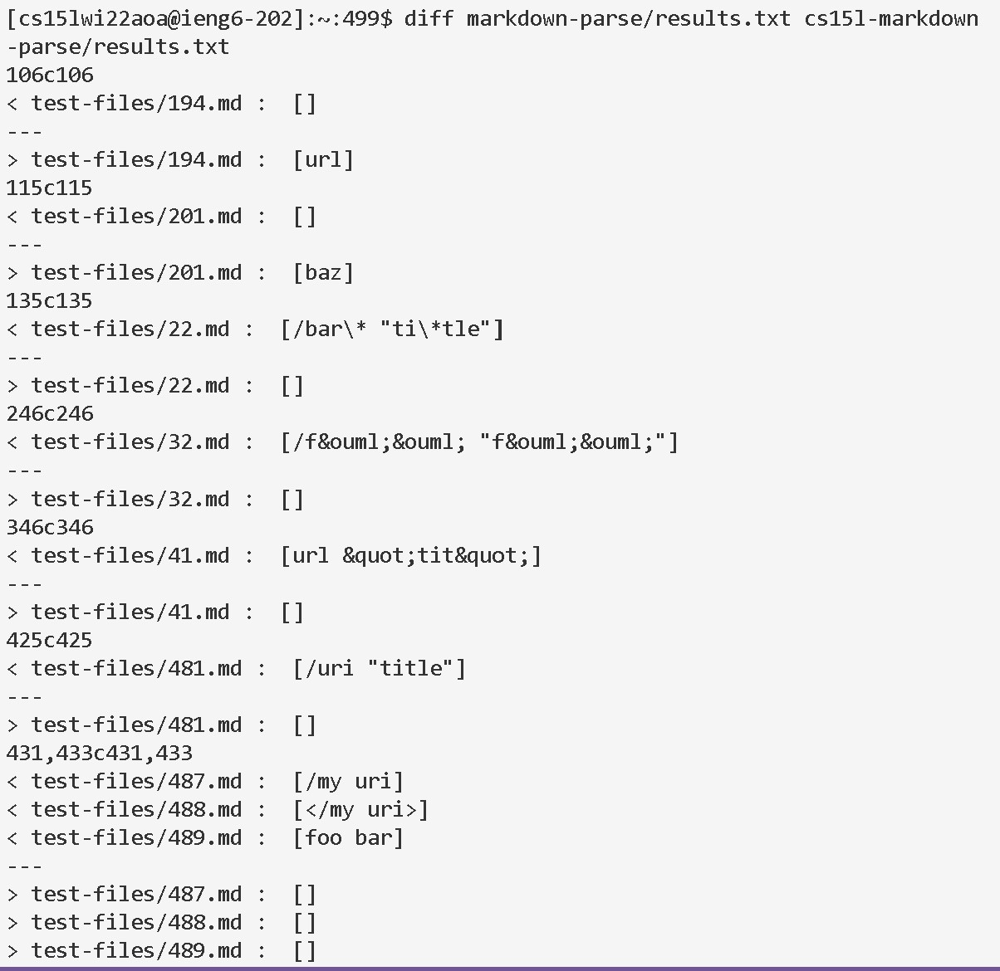
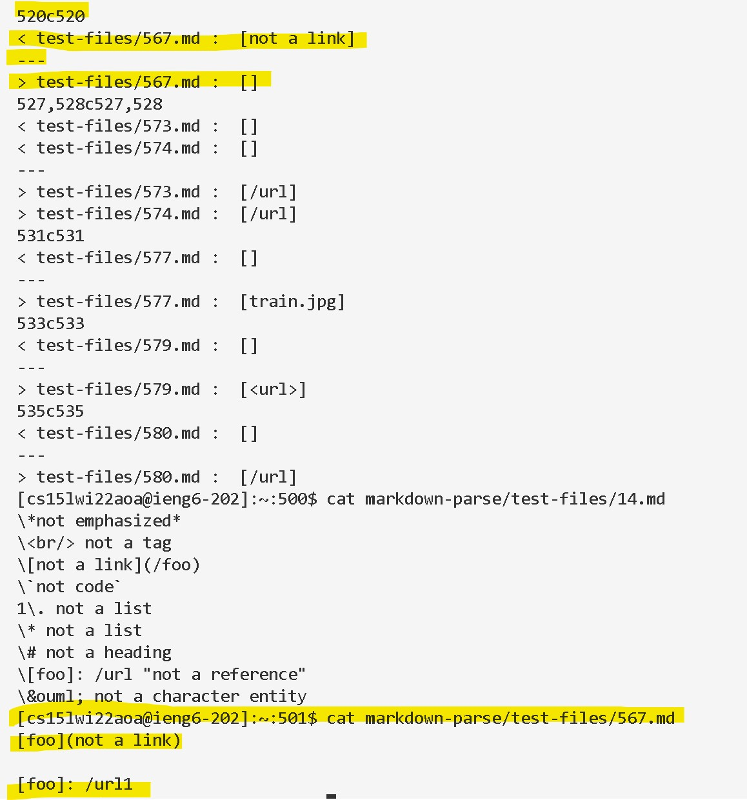
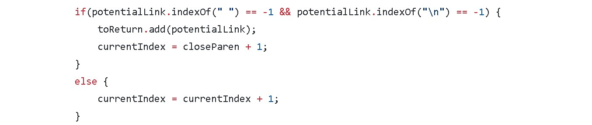
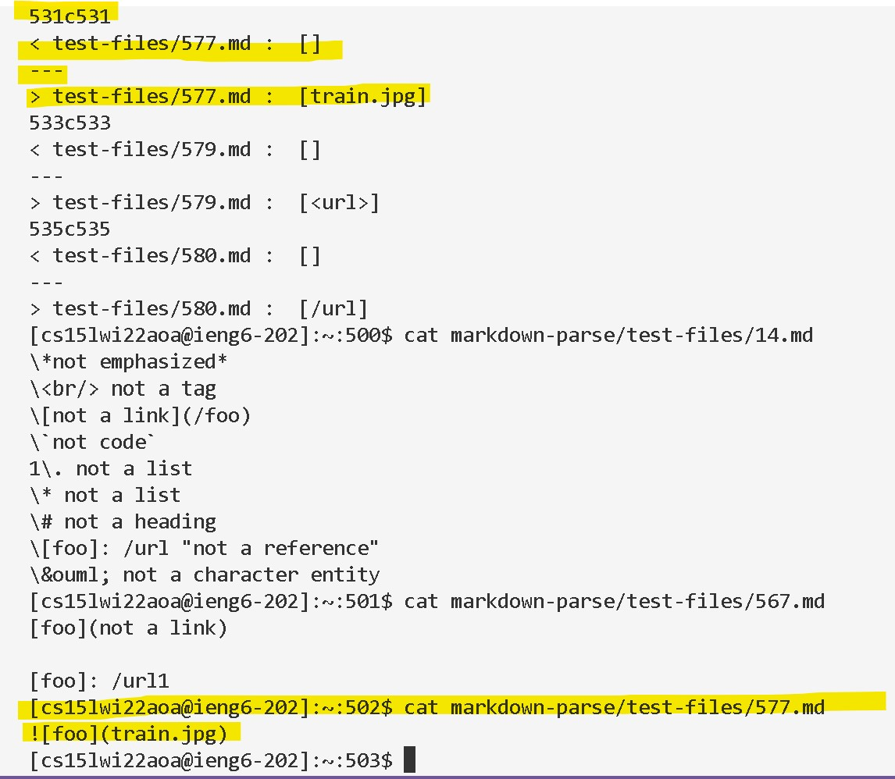
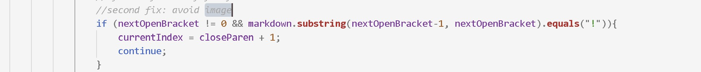

### Lab Report 5 - CSE 15L Week 10
\
\
During this lab, I used the command __diff__ to find out the different results between two markdown parse algorithm and try to distinguish with algorithm is correct. 
\

\
\
One of the difference from two test is in test-file 567.
\
\

\
\
In my implementation, it print out [not a link], but it is empty link in the class implementation. It suppose to print a empty link because there is a space between the wrod inside the parenthesis. It is a link, then it should not have a space. Therefore, the class implementation is correct, and the expected output is a empty list [].

For my implementation, I should add a if-statement to determine the contents inside the parenthesis inside the while loop.
\

The second bug came from the test file 577

My implementation is correct. We should not print out a jpg file from this algorithm. 
\
For the class implementation, it can add a if statement inside the while loop to determine whether it is a link or image. 
\
\

Using this if statement, we can avoid the image by find the the exclamation mark before the open paramethesis. 