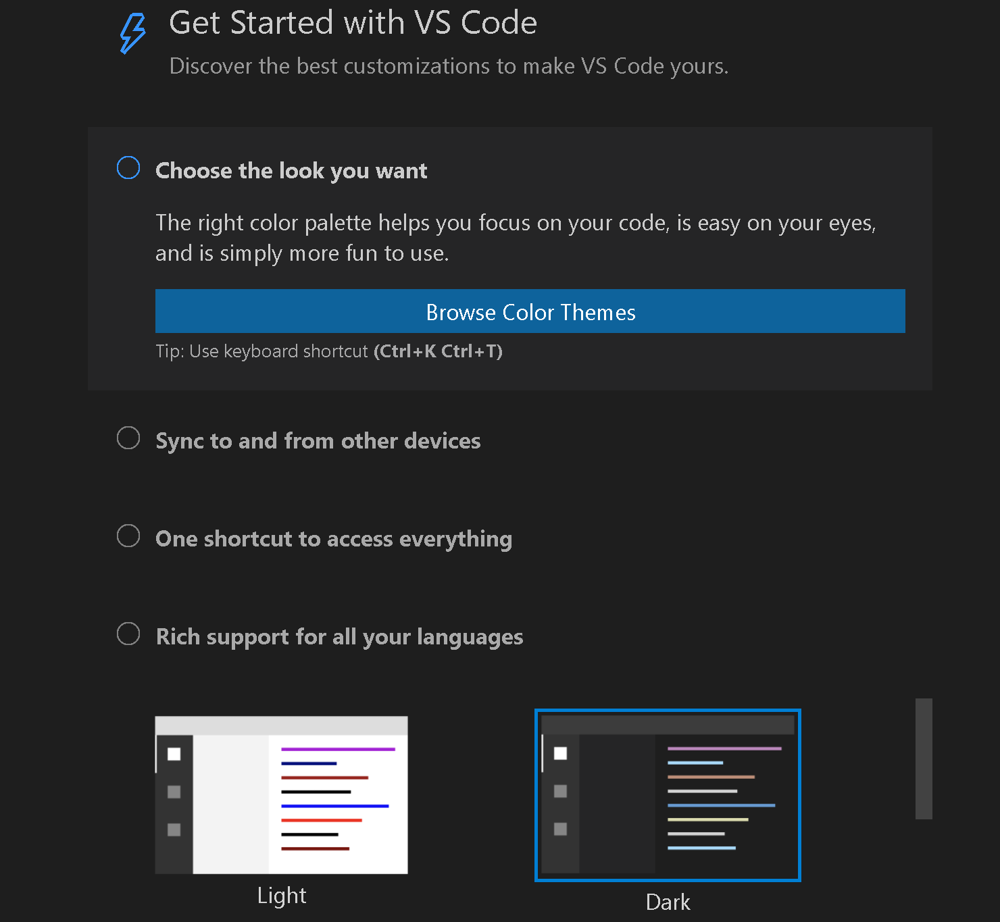
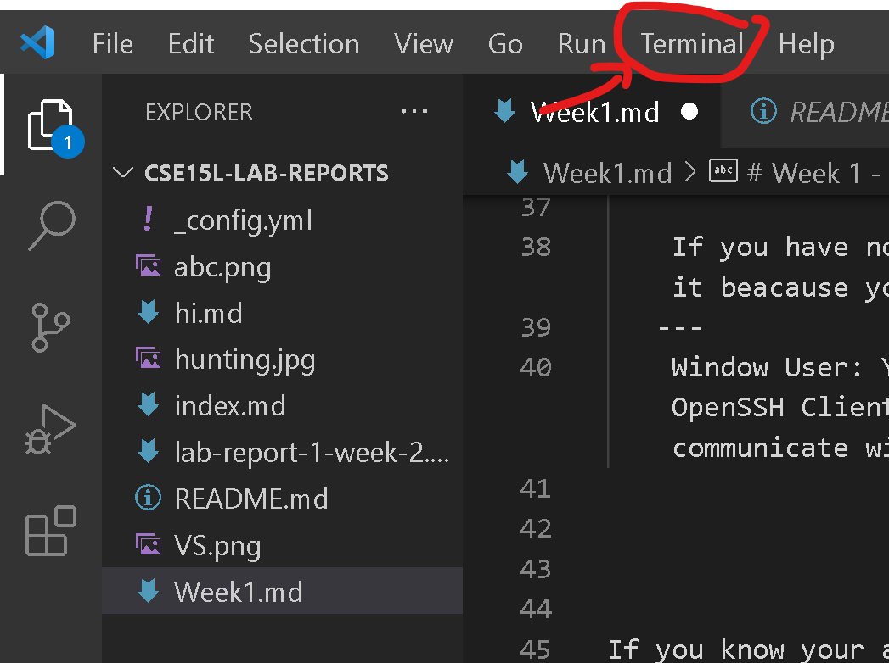
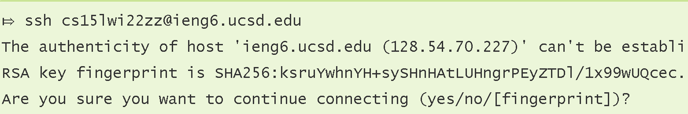
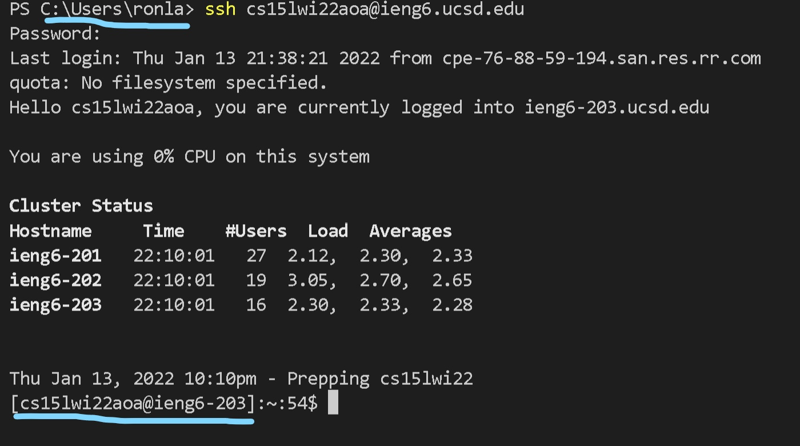
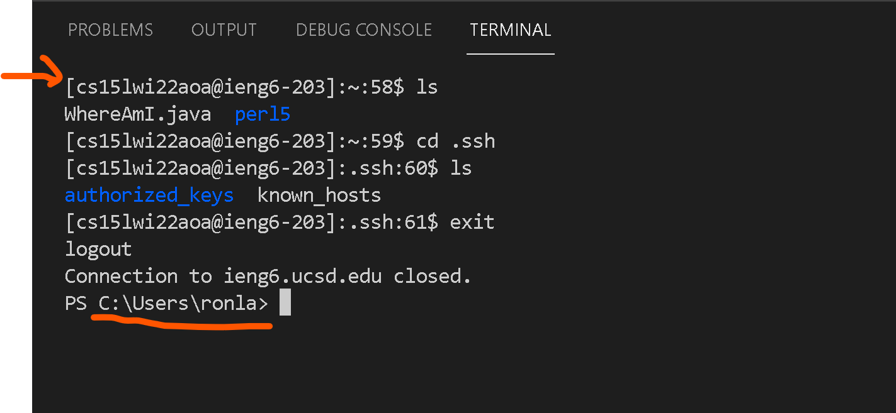
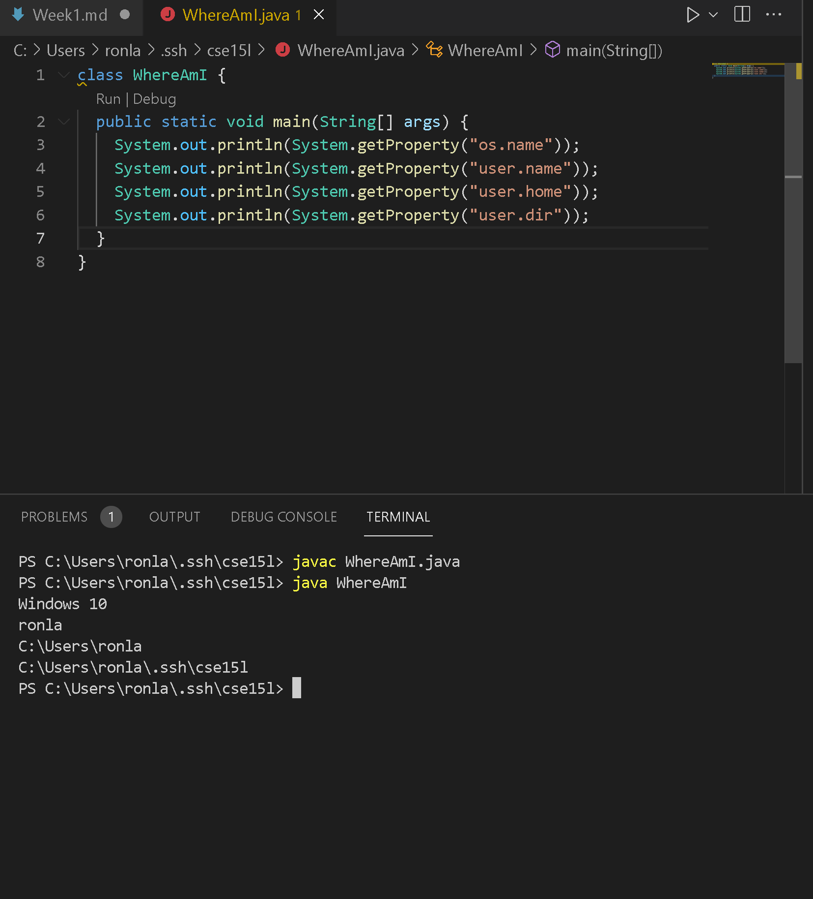
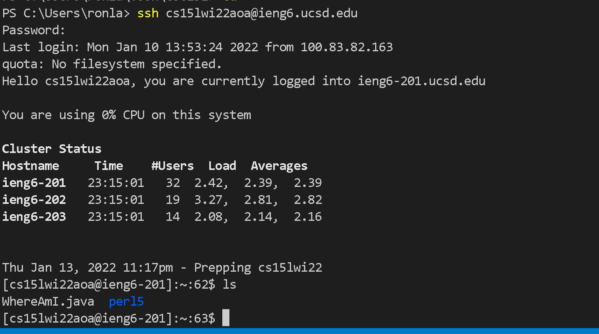
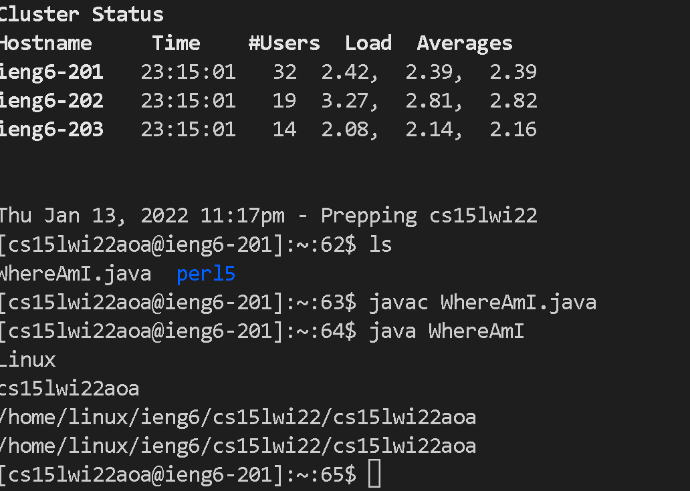
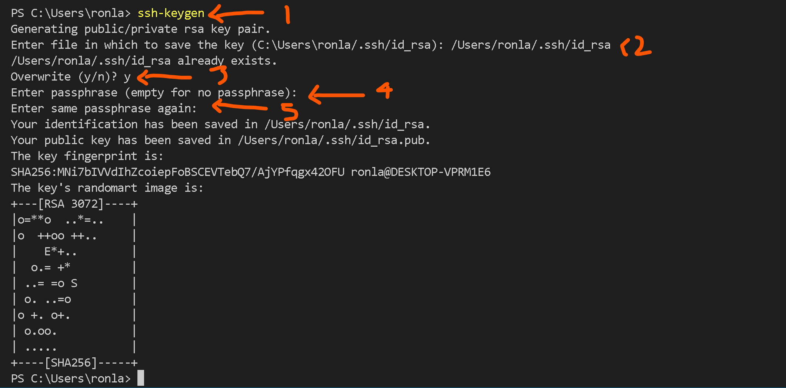
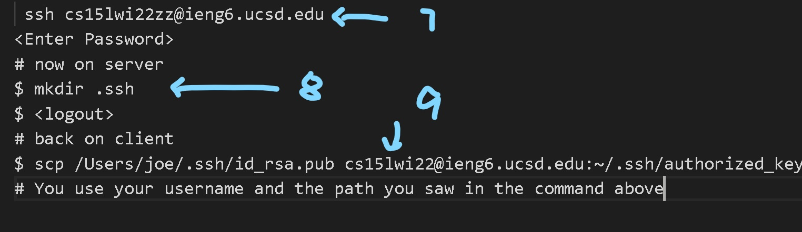

# Week 1 - Remote Access and File sysyem

\
Hi, CSE 15L student. Welcome to your first Lab.
\
\
\
Today, we are going to teach you how to connect to the ___ieng6___ server.

Imagine that you are working to a company. YOu are not working on your computer only. You also need to work with the server and upload your file with your collegue. Today, we are going to upload our file into the school server ieng6.
\
\

\
__Since there is so many people working with the server, some errors may be happened. Please be patients and keep trying.__ 
 
 

Feel Free to ask questions if you feel lost.
 
 

## Part 1 -  Password Reset and Looking up your account

This part is a part of part 2, but I recommand doing early because you may have trouble on reseting your password.

* Go to https://sdacs.ucsd.edu/~icc/index.php to look up your ieng6 account

When we are waiting, let introduce ourselves to your groupmate\
\
 

## Part 2 - Installing Visual Studio
\
The first thing we need to do is downloading Visual Studio Code(VSCode). VSCode is one of the famous Integrated Development Environment(IDE). This web and cloud application allows people to code with various extensions. We are going to use it to connect to our ieng6 server, but now, let download it on our computer first.

1. Go to VScode website to download this application https://code.visualstudio.com/.html
2. After you download it sucessfully, screenshot the VSCode interface and upload it to the google doc.

## Part 3 Remotely Connecting
\
After we download the VScode, we can try to connect to the ieng6 server. 

    If you have not finished part 0 yet, please go back and finish it beacause you need to know your account to log-in the server.
   --- 
    Window User: Your first step is downloading two program called OpenSSH Client and OpenSSh Server to allow your computer to communicate with another computer.

If you know your account and have changed your password, then please go ahead.

The following steps are coming from this article: [Remote Development using SSH](https://code.visualstudio.com/docs/remote/ssh#_connect-to-a-remote-host). If you want to learn more or clearfy the idea, you can use this link, but you can also use the follwing step.
1. Open a terminal in VSCode(ctrl+shift+`)

2. type your command at terminal(replace the yourAccountNumber)

        $ ssh yourAccountNumber@ieng6.ucsd.edu
3. Since this is your first time to connect the server, you may have such question. 
    
    
    Type Yes to connect the server.
4. Then, you will get into the server.

    

You can see that the directory has changed. Now, your command type on the terminal will happen another computer(Server).

## Part 4 Trying Some Commands

Let's try out different command on the terminal.
- cd
    - cd ~
- ls
    - ls -lat
    - ls a
- pwd
- mkdir
- cp
- cp /home/linux/ieng6/cs15lwi22/public/hello.txt ~/
- cat /home/linux/ieng6/cs15lwi22/public/hello.txt

        You can use ctrl+d or type exit to leave the server

After you try out some command, please explain it on the google doc.

## Part 5 moving FIles with ___scp___

Now, you have some understanding to connect to the server. Let's learn how to cope a file from your computer to the server.(It can be helpful on submiting homework.)

The command We are going to use is ___.scp___

___.scp___ command is used on your computer instead of the server, so please log-out the server before use it.

1. Let create a file called WhereAmI.java to upload it to ieng6
    \
    \
    Here is the code:
    \
    \
    
    \
    <empty>
2. Let compile the program to see what it does

3. Use the scp command, replace YourAccountName
 

        scp WhereAmI.java YourAccountName@ieng6.ucsd.edu:~/
4. Log in back to your account / the server to see the file using the command ___ls___

    

5. Compile WhereAmI.java again and run it to see what happen

6. Please explain what program does and what is the result.

## Part 6 Setting an ___SSH___ Key

you may notice that we have to use password when we log-in server. It is key of fraustrating, so we should use public key and private key to skip this process. What they does is let your computer having a key. When you do task in this computer, the server will recognize the key and let to get into it.

    If you are window user, you have some additional step to do. You may want to follow this guide to complete this part.

- [(Window)Use ssh keygen](https://docs.microsoft.com/en-us/windows-server/administration/openssh/openssh_keymanagement#user-key-generation)

Otherwise, you can use the following image.
1. type ssh-keygen
2. type the file address that you want to store the key. We recommand store it as  /Users/yourUserName/.ssh/id_rsa
3. Ignore it if it is your first time to genearte SSH key. Since I already have one, the system ask me to overwrite it.
4. don't type any thing. left it empty and enter.
5. don't type any thing. left it empty and enter.
6. you should have a key's randomart image in the terminal and have 2 file in 

7. Now log in the server
8. Use mkdir command to create .ssh file
9. log-out and use .scp command to upload your public key to the server

Now, you should be able to login without password.

## Part 7 Optimizing Remote Running
Now Lets learn how to command remotely. 

lets try this TWO commandS
    
    $ ssh cs15lwi22@ieng6.ucsd.edu "LS"
    $ cp WhereAmI.java OtherMain.java; javac OtherMain.java; java WhereAmI

let's tell us how does the command work.

## Part 8 Wrapup

Congragulation! You learned the basic of VSCode. Let try to make some reflection.

- How you think about VSCode
- What did you learn
- How you feel about coding remote
- Any more question about this course

Feel free to ask!!

That's is. Thank You so much for participation.

